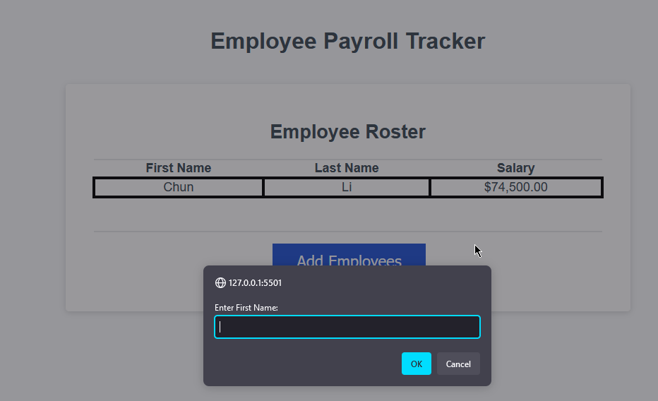

# BootcampSpot Challenge 03 - Payroll Tracker

## Description

Homework assignment for the third week of BootcampSpot's full stack webdev course, introducing the javascript language and using basic concepts of what it's capable of to control elements of a webpage, define and store variables, run comparisons and mathematical operators, and implement basic front-end user interactivity. In this challenge, a payroll tracker takes in user inputs to define an array of employees and their salaries, compile them together to display in a table on the web page, and print various aspects of them to the web console, including the array itself, an average salary derived from the combined sum of the salary values stored in each object, and a random employee selected from the array.

## Website URL

## Sample Images

## Installation

N/A

## Usage

This project is to be submitted upon completion for review and, if needed, additional work once it has been graded or given feedback for further improvement.

## Credits

N/A

## License

MIT License Copyright (c) 2024 Cassidy Pagels ('Mieruru') For full information, please refer to the LICENSE in the repo.